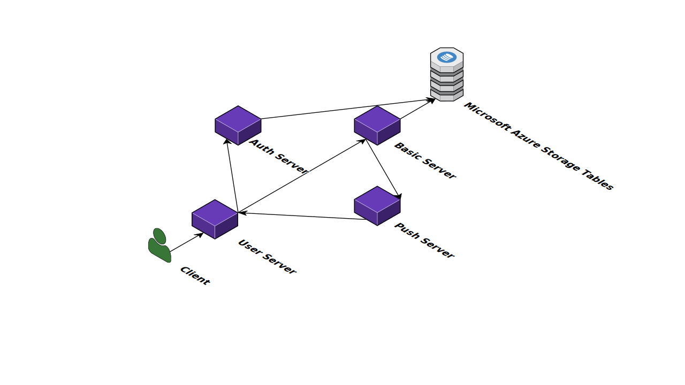

# Phaser

Set of C++ servers built with the [Microsoft C++ REST SDK](https://github.com/microsoft/cpprestsdk) which works as a back-end storage service in conjunction with [Microsoft Azure Storage](https://docs.microsoft.com/en-us/azure/storage/).

## Software Stack

| Purpose | Technology |
| --- | --- |
| Development Language | C++ |
| Back-End Web Server Framework | [Microsoft C++ REST SDK](https://github.com/microsoft/cpprestsdk) |
| Testing Framework | [UnitTest++](https://github.com/unittest-cpp/unittest-cpp) |
| Build System | [CMake](https://cmake.org/) |
| Application Container | [Vagrant](https://www.vagrantup.com/) |
| Database (Online) | [Microsoft Azure Storage](https://docs.microsoft.com/en-us/azure/storage/) |

## Setup

First, clone the repository to your local machine and enter the project directory:
```shell
git clone https://github.com/jleung51-coursework/phaser.git
cd phaser/
```

The cleanest way to run the server is to run it inside a virtual machine. To do this, install [VirtualBox](https://www.virtualbox.org/) and [Vagrant](https://www.vagrantup.com/) on your machine.

Build the virtual machine using the Vagrantfile in the project directory:
```shell
vagrant up
```

This will take some time to build.

Enter the virtual machine:
```shell
vagrant ssh
```

Enter the project directory within the virtual machine. This directory is mirrored to the directory on your local machine, so any changes made on your local machine will be reflected instantly.
```shell
cd phaser/
```

Create a file named `azure_keys.h` within the `include/` directory, using the default template. This file will be ignored by Git; do not commit it as it will contain sensitive credentials.
```shell
cp include/azure_keys_default.h include/azure_keys.h
```

### Setup for Microsoft Azure Storage Tables

Create a new Storage Account in Microsoft Azure.

In the file `include/azure_keys.h`, within the `tables_endpoint` variable, replace `USERNAME` with the username of your Storage Account.

Under _Settings_, click _Access Keys_.

1. Enter the displayed name of the Storage Account into the file `include/azure_keys.h` in the line `AccountName=`.
2. Choose one of the keys shown and add it to the file `include/azure_keys.h` in the line `AccountKey=`.

**Further instructions under construction...**

## Directory Structure

The `src/` directory contains the C++ source files for the servers.

The `include/` directory contains all header files.

The `build/` directory contains all the testing files, as well as the CMake build script.

# Architecture

[](https://cloudcraft.co/view/2fd5c9e2-af62-4f6b-bd66-0a8c4ca37062?key=twz6SxA3DCjY9L6F8anEvw)

There are 4 discrete servers in the system.

1. `BasicServer` handles standard Create/Read/Update/Delete operations to the databases.
2. `AuthServer` handles authentication and token access through directly interfacing with the databases as well.
3. `PushServer` takes notifications of updates from `BasicServer` and sends them to the user.
4. `UserServer` is the direct and only interface of the client, requesting and receiving data from the other 3 servers as required.

# About

This project was a group project in CMPT 276: Introduction to Software Engineering at Simon Fraser University for the Spring 2016 semester.

## Main Contributors

* Daphne Chong
* Jeffrey Leung
* Yi-Hsuan Wu
* Joshua Wu
